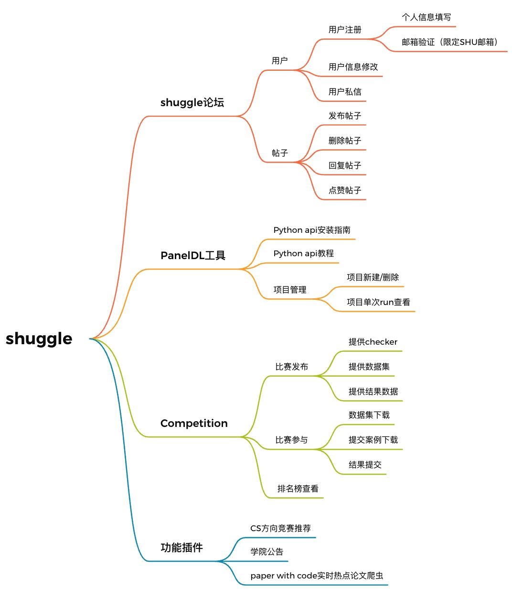

# shuggle

本项目目前已部署至http://zidea.site:5000

​	shuggle是面向全体上海大学学生的数据科学讨论与竞赛平台，分为**shuggle数据科学论坛**、**PanelDL深度学习训练可视化工具**、**SHU数据科学竞赛平台**三大板块，希望为有数据科学/深度学习兴趣的shu学生提供交流/竞赛平台。

## 需求分析

​	对于计算机科学专业的学生而言，竞赛可能是提高水平的最快方法之一，并且可以让同学们交流不同的做法。目前我校ACM方向的竞赛OJ网站正在紧急开发过程中，可是对于一些研究深度学习的同学却缺少一个讨论交流、相互学习的平台。为此我们开发shuggle数据科学平台，希望日后能真正让同学老师参与进来。目前本项目已部署至公网，但仅有SHU校园邮箱才可注册。

## 三大功能板块

SHUGGLE：SHU数据科学论坛

PanelDL：深度学习训练过程可视化工具

Competition ：SHU数据科学竞赛平台

## 功能小插件

竞赛推荐：鼓励各位参与ACM/KAGGLE/CTF等竞赛，这是提升个人能力的最好途径之一！

学院公告：直链计算机科学与技术官网，方便同学查看学院公告信息

实时热点：爬虫爬取paper with code实时最火热论文！鼓励同学看到AI领域最新进展

## 数据库设计

## 触发器

共有五个触发器，分别实现了如下功能：

- cleanmessage：用户之间可以发消息，当消息记录达到20条的时候会删除最晚发送的消息，从而保证消息内容不会过多。
- deletecomment：当用户删除文章时，自动删除对该文章的所有评论
- deleteverify：用户完成注册之后，登录时自动删除验证数据库中的验证码等信息
- insertuser：当用户注册时，为用户设置默认信息（如关注者、关注人数等）
- updatescore：用户提交竞赛成绩时，会比较新提交和之前提交的分数，保存最好的一次。